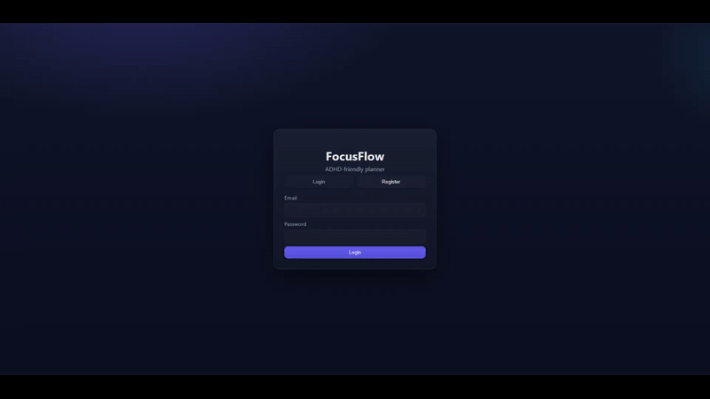

# CodingFactory 7 Final Project — FocusFlow (To-do Planner για άτομα με ΔΕΠΥ)

Backend: Node.js + Express + MongoDB (Mongoose) + Swagger

Frontend: React

Testing: Jest + Supertest

## Demo



## Απαιτήσεις
- Node 18+
- npm

## Εγκατάσταση

1) Backend
```
cd backend
npm install
npm run build
node dist/server.js
```
Κάνει initialize το Backend στο http://localhost:4000 με in-memory Mongo.

2) Frontend
```
cd frontend
npm install
npm start
```
Κάνει initialize το Frontend στο http://localhost:3000

## MongoDB με Docker

Για persistent memory, MongoDB instance μέσω Docker.

1) Install Docker Desktop

2) Launch MongoDB (μέσω docker compose)
```
docker compose up -d mongo
```
MongoDB container στο `localhost:27017` και θα αποθηκεύει τα δεδομένα στο `mongo-data`.

4) Εκκίνηση backend
```
cd backend
npm install
npm run build
npm start
```
Με αυτόν τον τρόπο ο server θα συνδεθεί στην MongoDB.

## Environment
Backend `.env`:
```
MONGODB_URI=mongodb://localhost:27017/focusflow
SESSION_SECRET=devsecret
CLIENT_ORIGIN=http://localhost:3000
PORT=4000
```

## API Docs
- Swagger: http://localhost:4000/docs

## Αρχεία Postman
Κάντε import `postman/FocusFlow.postman_collection.json` and `postman/FocusFlow.postman_environment.json`.

## Tests
```
cd backend
npm test
```

## Δομή
- backend/src: Express app, Mongoose models, repositories, services, controllers, routes, middleware, docs
- frontend/src: React app with authorization, pages (Login, Today, Focus, History, Plan)

## Features
- Auth (session cookies)
- Tasks (Today view with Now/Next/Later, quick add, move, done)
- Focus Sessions (start/stop, history)
- Routines (create, materialize today)
- Swagger and Jest tests
